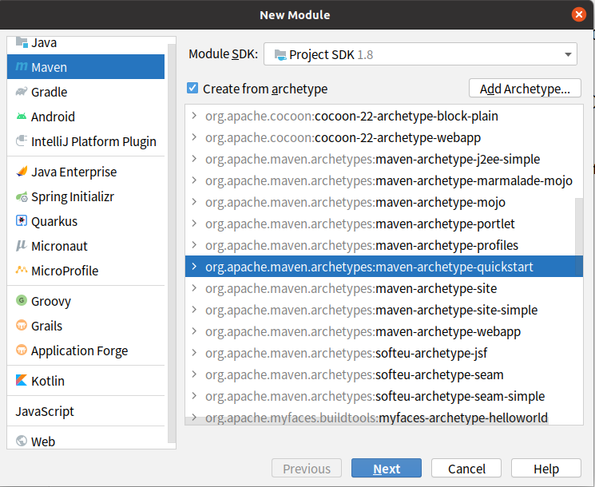
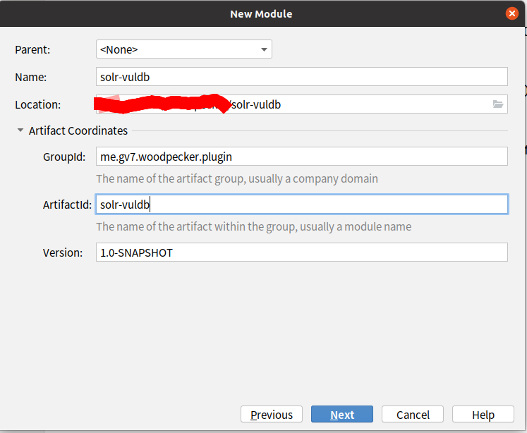
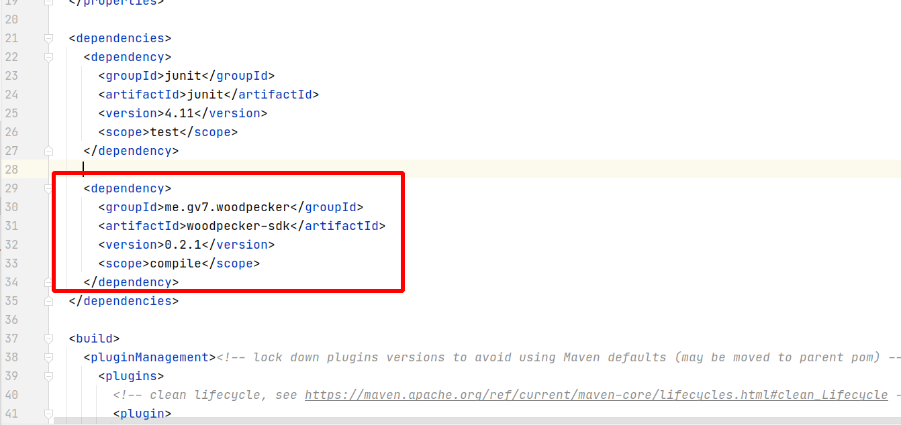
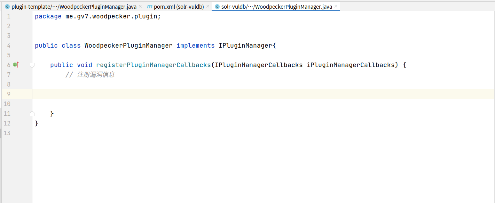

# Woodpecker 插件编写简单示范

woodpecker 漏洞插件开发的简单示范，用于插件的快速上手

详细的插件接口信息，请查阅 [开发手册](http://woodpecker.gv7.me/docs/)

## Woodpecker框架三大模块 

- InfoDetector 信息探测接口，插件通过实现该接口，可实现对目标全方位信息探测。
- Helper 辅助接口，可实现一些简单的小功能，比如数据的加解密等
- Exploit 攻击接口
    - Exploit 漏洞深度利用接口，插件通过实现该接口，可实现对漏洞各种深度利用
    - Poc     插件可以实现这个接口来对漏洞进行精准检测和批量扫描
    - Payload 荷载生成器接口，插件通过实现该接口，可生成各种类型payload

## 最佳实践

### InfoDetector
https://github.com/woodpecker-appstore/weblogic-infodetector

Weblogic信息探测插件,可用于

- 探测版本
- 探测t3协议是否开启
- 探测iiop协议是否开启
- 探测console是否存在
- 探测async组件是否存在
- 探测wls-wsat组件是否存在
- 探测bea_wls_internal组件是否存在
- 探测bea_wls_deployment_internal组件是否存在

### Helper
https://github.com/woodpecker-appstore/BCELConverter

BCELConverter可以方便的将java class转换成BCEL字符串，将BCEL字符串转换为java class

###  Exploit
https://github.com/woodpecker-appstore/apereo-cas-vuldb

CAS反序列化漏洞的利用框架

- Poc模块可用于批量漏洞的检测
- Exploit模块可对有漏洞的网站进行精准打击
- Payload模块可生成payload，进行手工测试
  
## 编写入门

### 创建项目


新建一个模块，选择quickstart 或者添加一个archetype



设置artifact的groupID，artifactID和version



在pom.xml中添加dependency

pom.xml
```xml
    <dependency>
      <groupId>me.gv7.woodpecker</groupId>
      <artifactId>woodpecker-sdk</artifactId>
      <version>0.2.1</version>
      <scope>compile</scope>
    </dependency>
```



创建WoodpeckerPluginManager.java



### 框架入口
漏洞编写，需从框架入口开始

me/gv7/woodpecker/plugin/WoodpeckerPluginManager.java
```java
package me.gv7.woodpecker.plugin;


public class WoodpeckerPluginManager implements IPluginManager{

    public void registerPluginManagerCallbacks(IPluginManagerCallbacks iPluginManagerCallbacks) {
        // 注册漏洞信息
        final VulPluginInfo vulInfo = new VulPluginInfo();
        final InfoPluginInfo infoPlugin = new InfoPluginInfo();

        iPluginManagerCallbacks.registerVulPlugin(vulInfo);
        iPluginManagerCallbacks.registerInfoDetectorPlugin(infoPlugin);

    }
}

```

入口可以看出，示例定义了VulPlugin和InfoDetectorPlugin。VulPlugin可用于定义Exploit攻击接口的三个模块，InfoDetectorPlugin可用于对目标全方位信息探测

src/main/java/me/gv7/woodpecker/plugin/VulPluginInfo.java
```java
package me.gv7.woodpecker.plugin;

import me.gv7.woodpecker.plugin.exploits.Exploit;
import me.gv7.woodpecker.plugin.infos.Info;
import me.gv7.woodpecker.plugin.payloads.Payload;
import me.gv7.woodpecker.plugin.pocs.Poc;

import java.util.ArrayList;
import java.util.List;

public class VulPluginInfo implements IVulPlugin {

    public static IVulPluginCallbacks callbacks;
    public static IPluginHelper pluginHelper;

    @Override
    public void VulPluginMain(IVulPluginCallbacks callbacks) {
        // 填写漏洞模块的信息

        callbacks.setVulPluginName("漏洞模块范例");
        callbacks.setVulPluginAuthor("Ppsoft1991");
        callbacks.setVulId("cve-2021-xxxx");
        callbacks.setVulDescription("漏洞的描述");
        // CVSS评分
        callbacks.setVulCVSS(9.0);

        // 漏洞类型
        callbacks.setVulSeverity(callbacks.VUL_CATEGORY_RCE);

        // 漏洞所属于的厂商
        callbacks.setVulProduct("websphere");

        // 漏洞的版本描述
        callbacks.setVulDescription("websphere<7.0");

        // 这里开始注册Exploit模块，Exploit模块的作用为对漏洞发起攻击
        List<IExploit> exploitList = new ArrayList<>();
        exploitList.add(new Exploit());
        callbacks.registerExploit(exploitList);

        // 注册Poc 做漏洞检测用
        callbacks.registerPoc(new Poc());

        // 注册Payload 模块的作用是exploit模块打不了，使用payload模块生成payload，然后进行手工利用
        List<IPayloadGenerator> payloads = new ArrayList<>();
        payloads.add(new Payload());
        callbacks.registerPayloadGenerator(payloads);


    }
}

```